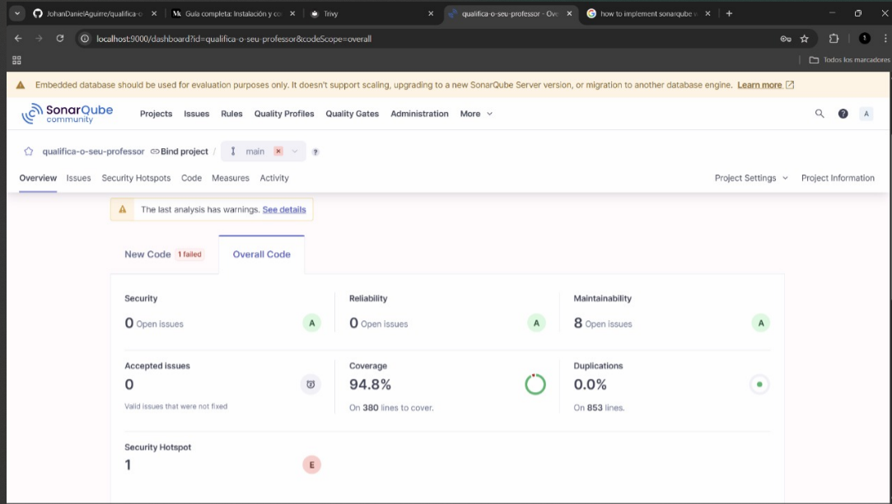
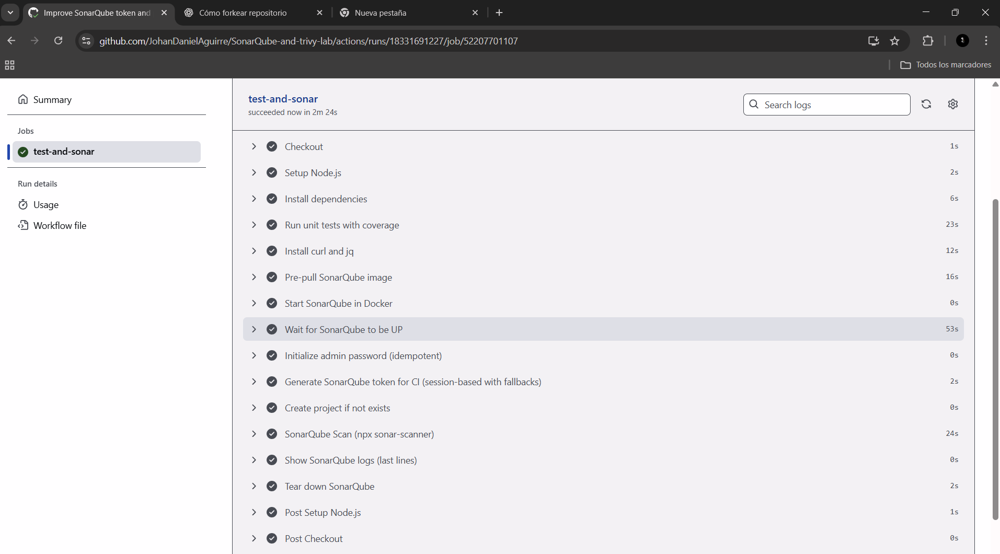
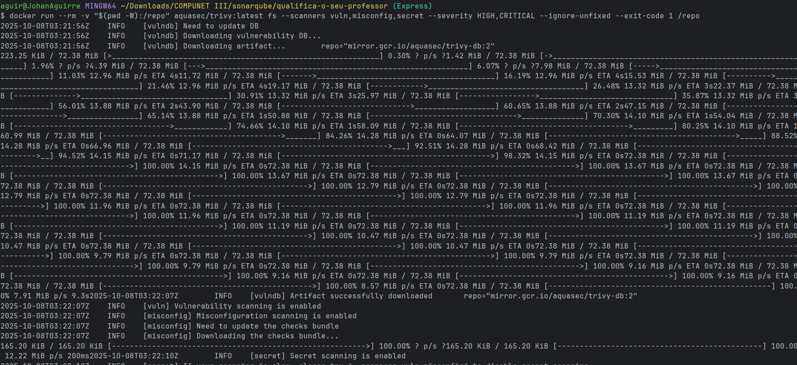

# SonarQube-and-trivy-lab

Analisis hecho con sonarQube durante la clase despues de agregar el properties al proyecto

Despues de hizo un Workflow en github actions para correr el analisis de sonarQube

Adicionalmente se hizo un analisis con trivy para revisar vulnerabilidades en las imagenes docker

